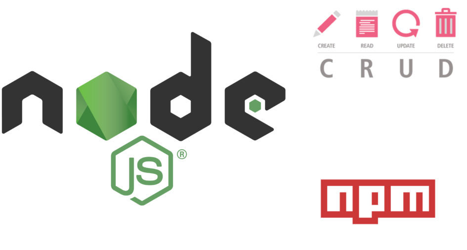

## Projeto Storage Manager (CRUD)
### O que um CRUD?
> Nas manipulações de registros realizadas diretamente em banco de dados ou em plataformas
> desenvolvidas no padrão RESTful, o conceito CRUD estabelece o modelo correto no manuseio
> desses dados.
> CRUD representa as quatro principais operações realizadas em banco de dados, seja no modelo 
> relacional (SQL) ou não-relacional (NoSQL), facilitando no processamento dos dados e na 
> consistência e integridade das informações.  
> [Fonte de Informação: Blog byTrybe ](https://blog.betrybe.com/tecnologia/crud-operacoes-basicas/);



### Em que consiste o projeto?
> Em desenvolver uma pequena API CRUD (Criar,visualizar, Deletar e Atualizar ), ou seja, realizar as quatros operações básicas e principais, de interação de uma cliente à API REST.

### Habilidades a serem adquiridas:
> Entender o funcionamento da camada de Model;
> Delegar responsabilidades específicas para essa camada;
> Conectar sua aplicação com diferentes bancos de dados;
> Estruturar uma aplicação em camadas;
> Delegar responsabilidades específicas para cada parte do seu app;
> Melhorar manutenibilidade e reusabilidade do seu código;
> Entender e aplicar os padrões REST;
> Escrever assinaturas para APIs intuitivas e facilmente entendíveis.

### 1 - Setup inicial da aplicação(Check List):

- [x] - Clonar repositório;
- [x] - Acessar repositório clonado;
- [x] - Instalar as dependências em caso de existência;
- [x] - Criar uma branch para trabalho;
- [x] - Em seguida utilizar as operações padrões do git para criar uma Pull Request;

```console
git status 
git add .
git commit -m"ci: setup inicial ..."
git push -u origin tonis-torres-projeto-xxxx
```
### 2 - Ferramentas e pacotes que utilizaremos no desenvolvimento da aplicação:

- [x] - Biblioteca "express": "^4.17.1";
- [x] - "@hapi/boom": "^9.1.0"; 
- [x] - "dotenv": "^8.2.0";
- [x] - "express-rescue": "^1.1.26";
- [x] - "frisby": "^2.1.2";
- [x] - "jest": "^26.4.1";
- [x] - "joi": "^17.6.0";
- [x] - "eslint-config-trybe-backend": "^1.0.3";
- [x] - "nyc": "^15.1.0",
- [x] - "git-commit-msg-linter": "^4.1.1";   
- [x] - "mysql-import": "^5.0.21";
- [x] - "nodemon": "^2.0.4";
- [x] - "mysql2": "^2.3.0";
- [x] -  MySQL Workbench (Ferramenta Gráfica);
- [x] - "body-parser": "^1.19.0";
- [x] - "mocha": "^8.4.0";
- [x] - "chai": "^4.3.4";
- [x] - "sinon": "^11.1.1";

 
